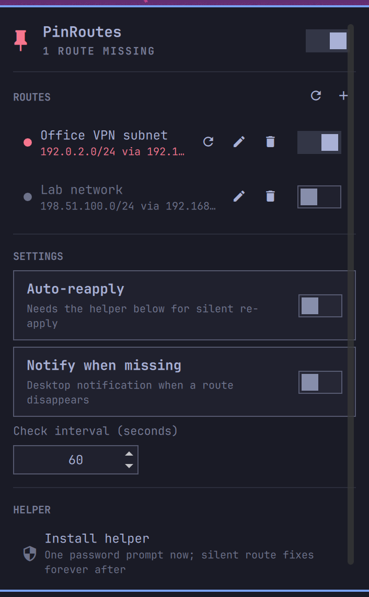

# 󰐃 PinRoutes for Omarchy

An [Omarchy](https://omarchy.org) shell plugin that keeps your static routes pinned. Routes get lost after sleep, VPN reconnects, or network changes — PinRoutes watches for that and puts them back.

This is the Linux/Omarchy port of the [PinRoutes macOS menu bar app](https://github.com/Positronico/pinroutes).



## Features

- **Bar widget** — a pin icon in the Omarchy bar; it turns urgent when a route goes missing
- **Route management** — add, edit, enable/disable routes with CIDR network + gateway from the panel
- **Event-driven monitoring** — watches netlink (`ip monitor route`), so lost routes are caught within a second of a VPN reconnect or resume, plus a periodic fallback check (15s–10min)
- **Auto-reapply** — optionally puts missing routes back automatically and silently
- **Notifications** — desktop notification when routes go missing (or when a silent re-apply fails)
- **Root helper** — install once with a single password prompt, then all route operations are silent (a root-owned validating binary plus a `NOPASSWD` sudoers entry scoped to it — the Linux analogue of the macOS SUID helper). Without it, user-initiated applies go through `pkexec` and Omarchy's themed auth dialog.

## Install

```bash
omarchy plugin add https://github.com/Positronico/pinroutes-omarchy.git --enable
```

That clones the plugin, validates it, and asks where on the bar to place it. To move it later:

```bash
omarchy bar move pinroutes --section right
```

Manual install: clone the repo to `~/.config/omarchy/plugins/pinroutes`, run `omarchy-shell shell rescanPlugins`, then `omarchy plugin enable pinroutes`.

## Usage

1. Click the 󰐃 icon in the bar, hit **+**, enter a name, CIDR network (e.g. `10.255.0.0/16`), and gateway (e.g. `10.0.0.1`).
2. Enabled routes are verified continuously; re-apply manually with the refresh button (or right-click the bar icon), or turn on **Auto-reapply**.
3. **Install helper** (recommended) — in the HELPER section of the panel. One password prompt; after that, all route operations happen silently, which is what makes background auto-reapply possible.

Bar icon: left-click opens the panel, right-click re-applies missing routes, middle-click re-verifies. In the panel: `j`/`k` move, `Enter` re-applies the selected route, `a` re-applies all, `n` adds a route, `r` refreshes, `Esc` closes.

## Security

Changing routes requires root, so this plugin has a deliberately small privileged surface. Full disclosure for reviewers and the appropriately suspicious:

- **`helper/pinroutes-helper`** — a ~50-line bash script whose entire command surface is `ip route replace <cidr> via <gateway>` and `ip route del <cidr>`. Every argument is regex-validated (strict IPv4/CIDR) before `ip` runs; anything else exits without executing.
- **Without the helper installed**, user-initiated applies run it via `pkexec` (Omarchy's themed polkit dialog, one prompt per operation). The background monitor *never* invokes pkexec — if it can't fix a route silently, it only notifies.
- **"Install helper"** runs `helper/pinroutes-helper-install` via `pkexec`, which copies the helper root-owned (0755) to `/usr/local/bin/pinroutes-helper` and writes `/etc/sudoers.d/pinroutes` (0440, validated with `visudo -cf` before install):

  ```
  <you> ALL=(root) NOPASSWD: /usr/local/bin/pinroutes-helper
  ```

  This is a passwordless rule scoped to that single fixed-purpose binary — the Linux analogue of the macOS app's SUID helper. It is what makes silent background re-apply possible.
- **Nothing else**: no network access, no downloads, no bundled binaries, no services. The plugin only ever executes `ip`, `notify-send`, `python3 stateio.py` (config file I/O), and the helper via `sudo -n`/`pkexec`.

Uninstall the helper from the panel, or manually:

```bash
sudo rm /usr/local/bin/pinroutes-helper /etc/sudoers.d/pinroutes
```

## Dependencies

Nothing beyond a stock Omarchy install: `iproute2`, `bash`, `python3`, `sudo`, `polkit`, `libnotify` (`notify-send`).

## Configuration

Routes and settings are stored in `~/.config/pinroutes/pinroutes.json`.

| Setting | Default | Description |
|---------|---------|-------------|
| Monitoring | On | Netlink watch + periodic verification |
| Check interval | 60s | Periodic fallback verify interval |
| Auto-reapply | On | Silently re-apply missing routes (needs the helper) |
| Notify when missing | On | Desktop notification via `notify-send` |

## Scripting (IPC)

```bash
omarchy-shell pinroutes status    # e.g. "3 routes pinned"
omarchy-shell pinroutes apply     # re-apply missing routes
omarchy-shell pinroutes refresh   # re-verify now
omarchy-shell pinroutes toggle    # open/close the panel
```

## Project structure

```
manifest.json        # Omarchy plugin manifest (bar-widget)
Panel.qml            # Bar icon + popup panel UI (instantiated per monitor)
Service.qml          # Singleton: route state, verification, apply, netlink monitor
qmldir               # Registers Service as a QML singleton
Model.js             # Pure helpers: CIDR validation, route-table matching
stateio.py           # Atomic, symlink-safe config file I/O
helper/
  pinroutes-helper           # Root helper: validated ip-route ops only
  pinroutes-helper-install   # Installs helper + scoped sudoers entry (pkexec)
```

Developing: the shell hot-reloads files saved under `~/.config/omarchy/plugins/`. If you keep the source elsewhere and symlink the plugin directory, saves aren't watched across the symlink — run `omarchy-shell shell rescanPlugins` after editing.

## License

[MIT](LICENSE)
